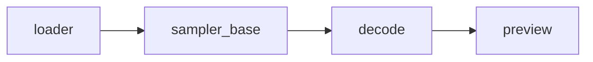

# `fabricatio-comfyui`

[](https://github.com/Whth/fabricatio/blob/master/LICENSE)

[](https://pypi.org/project/fabricatio-comfyui/)
[](https://pepy.tech/projects/fabricatio-comfyui)

Async ComfyUI API integration for Fabricatio — generate images from typed
knobs and download the results. Built on `httpx` with full Pydantic-typed
API coverage.

## Design: workflows are fully internal

The package owns its workflow graph: it is initialised entirely in Python
code (an internal typed `Graph` model) and serialized to ComfyUI's API
format only on submission. Callers never see, construct, or operate on a
workflow — they supply high-level knobs (`prompt`, `negative_prompt`,
`prop`, `mp`, `seed`, `steps`, `cfg`, `checkpoint`) and the package
parameterises the built-in template internally. There is no `dict[str, Any]`
workflow injection anywhere in the public signatures.

Naming follows `fabricatio-skill`: one `Use*` capability mixin
(`UseComfyUI`), a module-level one-shot function (`generate_image`), and
bare-noun response models (`ExecutionResult`, `QueueInfo`, …).
`workflows/` stays a docstring-only namespace, as in `fabricatio-skill`.

## Architecture

| Layer      | Module / Class                              | Purpose                                              |
| Graph      | `Graph` / `GraphSimple` / `AnimaGraph` (`models/graph.py`, `models/anima.py`) | Typed templates initialised in Python — two-pass, single-pass, and anima — serialized to the ComfyUI wire format; internal only |
| Transport  | `ComfyUIHttpClient` / `ComfyUIClientBase`   | Async REST client; shared per-URL via `get_comfyui_client` |
| Capability | `UseComfyUI` (`capabilities/comfyui.py`)    | Mixin: high-level generate (queue → poll → download)  |
| API        | `api.py`                                    | One-shot functions that run on the shared pooled client |
| Actions    | `GenerateImage`                             | Pluggable step for Fabricatio `WorkFlow`              |

## Installation

```bash
pip install fabricatio[comfyui]
# or
uv pip install fabricatio[comfyui]
```

## Configuration

All options below are read through the fabricatio configuration chain (see the
[Configuration Guide](../../docs/source/configuration.rst)). Set them under the
`[ext.comfyui]` table in `fabricatio.toml`, equivalently under
`[tool.fabricatio.ext.comfyui]` in `pyproject.toml`, or via
`FABRICATIO_EXT__COMFYUI__<FIELD_UPPER>` environment variables.

```toml
[ext.comfyui]
base_url = "http://127.0.0.1:8188"
timeout = 300.0
download_dir = "./outputs"
```

| Option | Type | Default | Description |
|---|---|---|---|
| `base_url` | `str` | `"http://127.0.0.1:8188"` | Base URL of the ComfyUI server (default localhost:8188). |
| `timeout` | `float` | `300.0` | Default timeout in seconds for API requests (default 5 min). |
| `checkpoint` | `str \| None` | `None` | Checkpoint applied to every generation; a per-call `checkpoint=` knob takes precedence. |
| `workflow` | `"default" \| "simple" \| "anima"` | `"default"` | Bundled template to run: the two-pass txt2img graph, the single-pass low-res graph, or the anima preset. |
| `mp` | `float \| None` | `None` | Default megapixel budget of the finished image (`1.0` = 1,000,000 px); a template that upscales before its final pass sizes its base canvas so the upscaled output lands at the budget, while single-pass templates size the latent directly; a per-call `mp=` wins; `None` keeps the active template's canvas (768x512 default, 1344x1024 anima). |
| `prop` | `Prop \| None` | `None` | Default aspect-ratio preset — enum member names (`prop_1_1`, `prop_4_3`, `prop_3_4`, `prop_3_2`, `prop_2_3`, `prop_16_9`, `prop_9_16`, `prop_5_4`, `prop_4_5`, `prop_21_9`, `prop_9_21`); a per-call `prop=` wins; `None` keeps the active template's ratio. |
| `anima_checkpoint` | `str \| None` | `None` | Checkpoint filename for the anima workflow (the template holds a placeholder in source). |
| `anima_clip` | `str \| None` | `None` | CLIP filename for the anima workflow. |
| `anima_vae` | `str \| None` | `None` | VAE filename for the anima workflow. |
| `download_dir` | `str \| None` | `None` | Default directory for generated images; a per-call `download_dir=` takes precedence. |

#### The simple workflow

`workflow = "simple"` runs a single sampler pass with no upscale and no
refine — the decode feeds the preview directly, so the submitted graph is
7 nodes instead of 11:



Use it when a hi-res pass is not worth the time (fast iteration) or when
you want the literal latent canvas.  Because nothing upscales, `mp` sizes
the latent directly rather than dividing by the upscale factor.

#### The anima workflow

The package ships a second bundled template — the *anima* preset — for
models that load checkpoint, CLIP, and VAE as separate files.  Select it
with `workflow = "anima"` and supply the real server-side filenames:

```toml
[ext.comfyui]
workflow = "anima"
anima_checkpoint = "your-anima-checkpoint.safetensors"
anima_clip = "your-anima-clip.safetensors"
anima_vae = "your-anima-vae.safetensors"
```

The template's model fields are placeholders in source; generation
resolves them from these keys and fails loudly while any is unset.  The
anima template samples once (`er_sde`, 32 steps) on a default 4:3
1344x1024 canvas (overridable per call or config via `mp` / `prop`).  LoRAs apply per call via the `loras` knob — each
entry names a server-side file and a strength, chained as stock
`LoraLoader` nodes between the model/CLIP sources and the sampler
(no custom node pack required).  Without a `loras` list the submitted
graph contains no LoRA node at all:

```python
from fabricatio_comfyui import generate_image
from fabricatio_comfyui.models import LoraSpec

path = await generate_image(
    "a cat",
    loras=[LoraSpec(lora_name="my-lora.safetensors", strength=0.8)],
)
```

Access at runtime: `from fabricatio_comfyui.config import comfyui_config`.

## Image size: megapixels x aspect ratio

Sizes are specified as a total pixel budget and an aspect ratio instead
of raw pixel dimensions, giving LLM callers a small discrete choice
surface while the package computes a model-friendly canvas:

* `mp` — megapixel budget of the **finished** image (`1.0` = 1,000,000 px).
* `prop` — aspect-ratio preset from the `Prop` StrEnum (members are
  declared with `auto()`, so member names double as the values).

The canvas derives from the active template's built-in canvas: a given
`mp` replaces the final pixel area, a given `prop` replaces its ratio,
then both dimensions snap to the nearest multiple of 64 (half-up, floor
64 px).  Either knob may be omitted — per-call knobs win over
`[ext.comfyui]` defaults, which win over the template canvas (768x512
for the default workflow, 1344x1024 for the anima preset).
The default two-pass template upscales its base canvas by 2.3x (area
5.29x) before the refine pass, so its base canvas is sized to
`mp / 2.3**2` and the finished image lands at the budget.  Templates with
no upscale step (the `simple` workflow and the anima preset) have a
latent canvas that *is* the finished image, so the budget applies
directly.

Presets: `prop_1_1` (1:1), `prop_16_9` / `prop_9_16` (16:9 / 9:16),
`prop_3_2` / `prop_2_3` (3:2 / 2:3), `prop_4_3` / `prop_3_4` (4:3 /
3:4), `prop_5_4` / `prop_4_5` (5:4 / 4:5), `prop_21_9` / `prop_9_21`
(21:9 / 9:21).

## Usage

### One-shot functions

The lowest-friction entry point — no Role, no client, no workflow:

```python
import asyncio
from fabricatio_comfyui import generate_image
from fabricatio_comfyui.models import Prop


async def main() -> None:
    path = await generate_image(
        "masterpiece, best quality, a mountain landscape",
        negative_prompt="worst quality, blurry",
        prop=Prop.prop_16_9,
        mp=1.0,
    )
    print(path)  # Path to the generated image, or None on failure


asyncio.run(main())
```

### Capability mixin (with a Role or Action)

Mix `UseComfyUI` into a Role to get the same typed-knob methods:

```python
from fabricatio import Role
from fabricatio_comfyui import UseComfyUI


class ImageRole(Role, UseComfyUI):
    """Role with ComfyUI image generation capability."""


# then: path = await role.generate_image("a mountain landscape")  # Path | None
```

### Propose the whole instruction (`SketchSpec`)

`SketchSpec` is the propose-able generation instruction: positive prompt,
negative prompt, and canvas size in one Pydantic model.  Let the LLM fill
it in a single `propose` call (role needs the framework's `Propose` mixin
as usual) instead of composing prompt and size knobs by hand:

```python
from fabricatio_comfyui import SketchSpec

spec = await role.propose(SketchSpec, "a wide establishing shot of the harbour at dusk")
# spec: SketchSpec | None — prompt/negative_prompt plus the LLM-chosen prop and mp
path = await role.generate_image(
    spec.prompt, negative_prompt=spec.negative_prompt, prop=spec.prop, mp=spec.mp
)
```

### Action (in a WorkFlow)

Use `GenerateImage` as a composable step:

```python
from fabricatio import WorkFlow
from fabricatio_comfyui import GenerateImage

GenerateImageWorkflow = WorkFlow(
    name="ComfyUI Generate",
    steps=(
        GenerateImage(
            prompt="masterpiece, best quality",
            download_dir="./outputs",
        ),
    ),
)
```

### Standalone client (advanced)

The mixin and the one-shot functions share one pooled client per server
URL, obtained from the cached factory
`fabricatio_comfyui.http_client.get_comfyui_client` — never close the
client it returns.  When you need a *private* pool instead (tests,
alternate backends), build a scoped one with `async with`:

```python
import asyncio
from fabricatio_comfyui import ComfyUIHttpClient


async def main() -> None:
    async with ComfyUIHttpClient.create() as client:
        results = await client.generate("a mountain landscape", seed=42)
        if results[0].succeeded():
            await client.download_images(results[0], "./outputs")


asyncio.run(main())
```

## API Reference

### Capability methods (`UseComfyUI`)

| Method                        | Description                                                            |
|-------------------------------|------------------------------------------------------------------------|
| `generate_image(prompt, …)`   | Queue the bundled graph → poll → download → return the image path (`Path \| None`); cancelling the call interrupts the running job server-side |

`generate_image` keyword parameters: `negative_prompt`, `prop`, `mp`,
`seed`, `steps`, `cfg`, `checkpoint`, `loras`, `download_dir`, `timeout`.
`download_dir` resolution: per-call argument → scoped config on the
Role (`UseComfyUI` inherits `ComfyUIScopedConfig`; set it as a subclass
default `class ImageRole(Role, UseComfyUI): download_dir: str = "./outputs"`
or per instance) → `[ext.comfyui] download_dir` config.

On failure the methods above return `None` — a single prompt yields at most
one image file path.  A list of prompts yields a list with one entry per
prompt (`Path | None` each, `None` marking a failed generation), generated
sequentially:

```python
paths = await role.generate_image(["a mountain", "a river"])
# paths: list[Path | None] — [path, None] when the second generation failed
```

The module-level function in `fabricatio_comfyui.api` (`generate_image`)
shares the exact same keyword surface and hides the client lifecycle
entirely.  Server-side state inspection and control (queue, history,
interrupt) stay on the client transport, which mirrors the REST API
one-to-one — `generate` interrupts the running job automatically when
its awaiting task is cancelled.

### Client methods (`ComfyUIHttpClient` / `ComfyUIClientBase`)

| Method                            | Returns            | Description                              |
|-----------------------------------|--------------------|------------------------------------------|
| `generate(prompt, …)`             | `list[ExecutionResult]` | Queue each prompt (`str` or list) and poll; `loras` chains LoRA nodes into the graph; one result per prompt, in order; cancelling interrupts the running job |
| `get_queue_info()`                | `QueueInfo`        | Fetch current queue status               |
| `get_history(prompt_id)`          | `HistoryEntry \| None` | Retrieve execution history for a prompt |
| `wait_for_completion(prompt_id)`  | `ExecutionResult`  | Poll until execution finishes            |
| `get_image(filename, …)`          | `bytes`            | Download a single generated image        |
| `upload_image(image_path, …)`     | `UploadResponse`   | Upload an image                          |
| `interrupt()`                     | `None`             | Interrupt the running generation         |
| `download_images(result, dir)`    | `list[Path]`       | Download all output images concurrently; returns their local paths |
| `download_first_image(result, dir)` | `Path \| None`  | Download the first output image and return its local path |

### Actions

| Class          | Fields                                                                                                    | Description                        |
|----------------|-----------------------------------------------------------------------------------------------------------|------------------------------------|
| `GenerateImage` | `prompt`, `negative_prompt`, `prop`, `mp`, `seed`, `steps`, `cfg`, `checkpoint`, `download_dir`, `timeout` | Generate images from typed knobs |

### Models

API responses are deserialized into frozen Pydantic models; `SketchSpec`
below is the propose-able generation instruction:

| Model            | Description                                              |
|------------------|----------------------------------------------------------|
| `PromptResponse` | Response from `POST /prompt` — contains `prompt_id`      |
| `ExecutionResult`| Final result — `outputs`, `all_images`, `succeeded`      |
| `OutputImage`    | Single image metadata — `filename`, `subfolder`, `type`  |
| `HistoryEntry`   | Execution history — `status`, per-node `outputs`         |
| `QueueInfo`      | Queue state — `queue_running`, `queue_pending`           |
| `UploadResponse` | Upload result — `name`, `subfolder`, `type`              |
| `SketchSpec`     | Complete generation instruction — `prompt`, `negative_prompt`, `prop`, `mp` — proposed by the LLM in one `propose` call |

## License

MIT — see the [LICENSE](https://github.com/Whth/fabricatio/blob/master/LICENSE) file.
