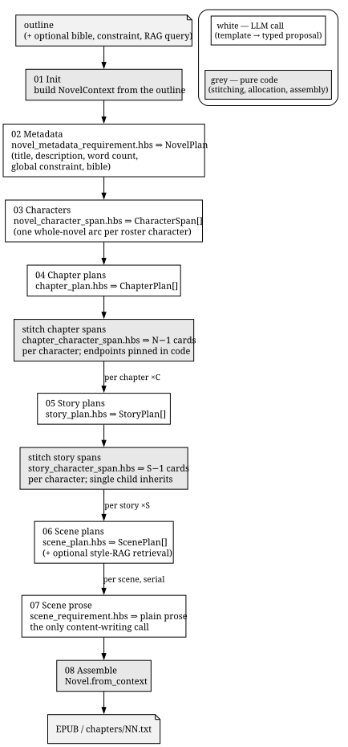
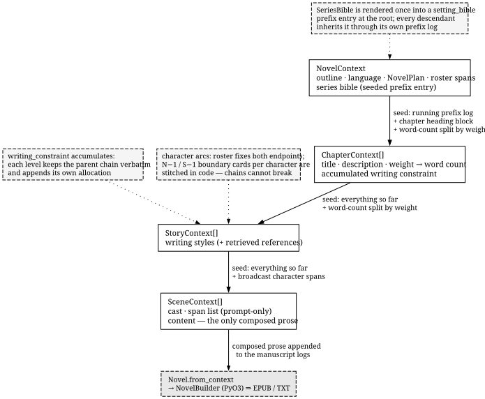
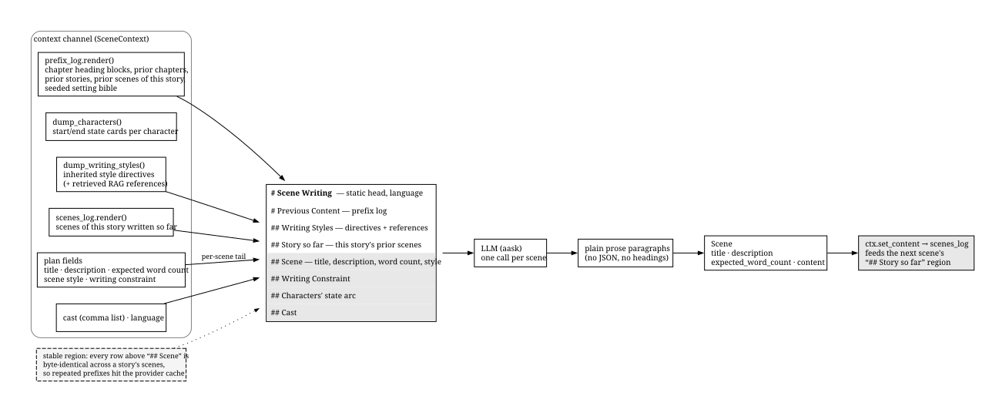

# `fabricatio-novel`

[MIT](https://img.shields.io/badge/license-MIT-blue.svg)

[](https://pypi.org/project/fabricatio-novel/)
[](https://pepy.tech/projects/fabricatio-novel)
[](https://pepy.tech/projects/fabricatio-novel)
[](https://github.com/PyO3/pyo3)
[](https://github.com/astral-sh/uv)

AI-powered novel generation — outline to publication-ready EPUB.

> Full dataflow and generation-logic walkthrough:
> [docs/superpowers/specs/2026-08-21-novel-generation-dataflow.md](../../docs/superpowers/specs/2026-08-21-novel-generation-dataflow.md)

## Installation

```bash
pip install fabricatio[novel]
# or
uv pip install fabricatio[novel]
```

For the CLI tool:

```bash
pip install fabricatio-novel[cli]
```

## Pipeline

Generation runs a staged, template-driven pipeline over a context tree
(`NovelContext → ChapterContext → StoryContext → SceneContext`), with every plan and
character state proposed by the LLM in batched calls:

1. **Metadata** — outline → `NovelPlan` (title, description, word count, global writing
   constraint, bible)
2. **Characters** — bible roster → one `CharacterSpan` (start + end card) per character
   for the whole novel
3. **Chapters** — chapter plans, then **N-1 boundary cards** per character so chapter 1
   starts at the roster start and the last chapter ends at the roster end
4. **Stories** — per chapter: story plans, then **S-1 boundary cards** per character
   anchored on the chapter's start/end
5. **Scenes** — per story: scene plans; the story's spans are broadcast to every scene,
   which is where the prose is actually written
6. **Assembly** — the composed context tree becomes a `Novel`; `NovelBuilder`
   (Rust/PyO3) produces the EPUB

Character state is **two pure cards, never an interpolated chain**: the LLM is only
asked for the coarsest boundary states, and code stitches them so continuity is
guaranteed. Single-child levels inherit their parent's spans with no LLM call.

The CLI runs the pipeline as a **staged workflow** (`DebugNovelWorkflow`), persisting a
whole-tree JSON snapshot after every stage so any wrong result is traceable:

```
01_init → 02_metadata → 03_characters → 04_chapter_plans → 05_story_plans
       → 06_scene_plans → 07_scenes → 08_novel → 09_export
```

An optional RAG variant (`RagDebugNovelWorkflow`) retrieves `WritingStyleDocument`
entries from LanceDB once per story and renders them raw into the scene prompts.

## Data Flow & Prompt Assembly

The pipeline follows one principle: **every LLM touchpoint is a template plus named
context variables, and nothing else**. Each stage renders a Handlebars template from the
current context channel; planner calls parse the reply into validated pydantic models,
while the single prose call captures raw paragraphs. Everything between calls — word-count
allocation, character-arc stitching, prefix propagation, assembly — is deterministic code.

<p align="center"></p>

### LLM call inventory

| Stage | Template · prompted with | Yields |
|---|---|---|
| Metadata | `novel_metadata_requirement` ← `outline`, `language`, `constraint` | `NovelPlan` (adopted onto the root) |
| Roster spans | `novel_character_span` ← bible prompt block, title, description | `CharacterSpan[]` — skipped without a roster |
| Chapter plans | `chapter_plan` ← outline, novel fields, word count, styles, constraint, characters | `ChapterPlan[]` |
| Chapter boundaries | `chapter_character_span` ← roster spans, chapter titles/descriptions | N−1 boundary cards per character |
| Story plans | `story_plan` ← chapter fields, styles, constraint, characters, cast | `StoryPlan[]` |
| Story boundaries | `story_character_span` ← chapter spans, story titles/descriptions | S−1 boundary cards per character |
| Scene plans | `scene_plan` ← story fields, styles, constraint, characters, cast | `ScenePlan[]` |
| Scene prose | `scene_requirement` ← 11 variables, see below | plain prose → `Scene.content` |

Templates live in `templates/built-in/` and are selectable through the
[Configuration](#configuration) keys below.

### What flows down the tree

Plans materialize into child contexts via `from_plan`; each level then passes state down:

- **Running manuscript** — an append-only `ContextLog`; every walk seeds each child with
  exactly the bytes that precede it in the final book (`iter_prefixed_contexts`)
- **Setting bible** — rendered once at the root into a `setting_bible` prefix entry;
  every descendant inherits it through its own log
- **Word budget** — each level splits its `expected_word_count` among children by plan weight
- **Writing constraint** — accumulated verbatim down the chain
- **Character arcs** — the roster fixes both endpoints; intermediate boundary cards are
  proposed per level and stitched in code; scenes receive the finished span list read-only

Composed prose flows back up: scene content enters the logs, and `Novel.from_context`
aggregates the whole tree for export.

<p align="center"></p>

### How a scene prompt is assembled

The scene write is the only content-producing call, so its prompt is engineered for
provider prefix caching: every row above `## Scene` is byte-identical across the scenes
of a story, and divergence starts exactly at the per-scene tail.

<p align="center"></p>


## Key Classes

### Context channels

| Class | Role |
|---|---|
| `NovelContext` | Root channel: outline, language, roster `charactor_span`, `chapter_context` |
| `ChapterContext` | Chapter channel: `charactor_span`, `story_context`, heading block |
| `StoryContext` | Story channel: `charactor_span`, `scene_context`, accumulated `writing_styles`, optional `rag` retrieval settings |
| `SceneContext` | Leaf channel: broadcast `charactor_span`, `content` (the only composed prose) |
| `CharacterSpan` | Start + end `CharacterCard`; `derive_child_spans` stitches boundary cards |
| `ContextLog` / `ContextEntry` | Append-only manuscript log per channel: `append`, `branch` (fork history), `clear` (fresh fork); renders the prefixed-content prompt streams |
| `SeriesBible` | `characters` name list + `background_settings` fact list; rendered once into a `setting_bible` prefix entry at the root |

Every channel carries its running manuscript as an **append-only `ContextLog`**: composed
blocks enter as frozen `ContextEntry` records, parents seed children with pure log snapshots,
and prompts render them exactly like the former prefixed-content strings. Logs support
`with_entry`/`with_entries` appends, `branch()` to fork alternative continuations from any
point (copy-on-write), and `clear()` which returns a fresh empty log while the original
history stays intact.

### Plans & models

| Class | Description |
|---|---|
| `NovelPlan` | Novel metadata: title, description, word count, global constraint, bible |
| `ChapterPlan` / `StoryPlan` / `ScenePlan` | Weighted per-element plans (title, description, weight, style, constraint, cast) |
| `Scene` / `Story` / `Chapter` / `Novel` | Materialized output tree with word-count satisfaction |
| `WritingStyleDocument` / `EnrichedDocument` | LanceDB-backed writing-style references |

### Capabilities (mixins)

| Class | Description |
|---|---|
| `SceneCompose` | Scene requirement rendering + prose generation |
| `StoryCompose` | Scene planning, scene write preparation, serial scene composition |
| `ChapterCompose` | Story planning, `draft_story_spans` (S-1 boundary cards), story composition |
| `NovelCompose` | Metadata, `prepare_character_span` (roster), chapter planning, `draft_chapter_spans` (N-1 boundary cards) |
| `RAGCompose` | Retrieves style docs once per story; extends scene prompts |
| `BibleCompose` | Creates/updates the setting bible from an outline |

### Actions (staged workflow)

| Action | Stage |
|---|---|
| `InitNovelContext` | `01_init` — build context from outline/language/constraint/bible |
| `MetadataStage` | `02_metadata` — propose novel plan |
| `CharactersStage` | `03_characters` — propose roster spans |
| `ChapterPlanStage` | `04_chapter_plans` — plan chapters + draft boundaries |
| `StoryPlanStage` | `05_story_plans` — plan stories + draft boundaries |
| `ScenePlanStage` / `RagScenePlanStage` | `06_scene_plans` — plan scenes (with RAG) |
| `SceneWriteStage` / `RagSceneWriteStage` | `07_scenes` — broadcast spans + write scene prose |
| `AssembleStage` | `08_novel` — materialize `Novel` |
| `DumpNovelStage` | export — JSON always; EPUB and/or per-chapter `chapters/NN.txt` per `format` |

### Workflows

| Workflow | Description |
|---|---|
| `DebugNovelWorkflow` | Outline → exported novel (`--format epub\|txt\|both`), one stage per action with per-stage snapshots |
| `RagDebugNovelWorkflow` | Same, with writing-style RAG per story |

### Rust / PyO3

| Symbol | Description |
|---|---|
| `NovelBuilder` | Builder for EPUB 3.0 novels: title/description/authors, chapters (auto-XHTML), cover, fonts, CSS, TOC |
| `text_to_xhtml_paragraphs` | Plain text → `<p>`-wrapped XHTML paragraphs |

## Configuration

All options below are read through the fabricatio configuration chain (see the
[Configuration Guide](../../docs/source/configuration.rst)). Set them under the
`[ext.novel]` table in `fabricatio.toml`, equivalently under
`[tool.fabricatio.ext.novel]` in `pyproject.toml`, or via
`FABRICATIO_EXT__NOVEL__<FIELD_UPPER>` environment variables.

```toml
[ext.novel]
novel_metadata_requirement_template = "built-in/novel_metadata_requirement"
```

| Option | Type | Default | Description |
|---|---|---|---|
| `novel_metadata_requirement_template` | `str` | `"built-in/novel_metadata_requirement"` | template used to extract the novel metadata (title, synopsis, word count) from the outline. |
| `chapter_plan_template` | `str` | `"built-in/chapter_plan"` | template used to plan the chapters of the novel from the outline and metadata. |
| `story_plan_template` | `str` | `"built-in/story_plan"` | template used to plan the stories of a chapter. |
| `scene_plan_template` | `str` | `"built-in/scene_plan"` | template used to plan the scenes of a story. |
| `scene_requirement_template` | `str` | `"built-in/scene_requirement"` | template used to write a single scene in full prose. |
| `render_chapter_xhtml_template` | `str` | `"built-in/render_chapter_xhtml"` | template used to render a chapter as a full XHTML document. |
| `setting_bible_characters_template` | `str` | `"built-in/setting_bible_characters"` | template used to propose the bible's character roster as a list of plain strings, one character per item. |
| `setting_bible_background_template` | `str` | `"built-in/setting_bible_background"` | template used to propose the bible's background settings as a list of strings. |
| `setting_bible_context_template` | `str` | `"built-in/setting_bible_context"` | template that renders the bible into the block seeded into the running manuscript prefix. |
| `setting_bible_export_template` | `str` | `"built-in/setting_bible_export"` | template used to render the bible as a human-readable markdown document. |
| `writing_style_as_prompt_template` | `str` | `"built-in/writing_style_as_prompt"` | template used to render writing style documents as prompts. |
| `enriched_as_prompt_template` | `str` | `"built-in/enriched_as_prompt"` | template used to render enriched reference documents as prompts. |
| `novel_character_span_template` | `str` | `"built-in/novel_character_span"` | template used to propose the novel roster as one CharacterSpan per character. |
| `chapter_character_span_template` | `str` | `"built-in/chapter_character_span"` | template used to draft the N-1 chapter-boundary cards from the novel roster spans. |
| `story_character_span_template` | `str` | `"built-in/story_character_span"` | template used to draft the S-1 story-boundary cards from the chapter's spans. |

Access at runtime: `from fabricatio_novel.config import novel_config`.

## Usage

### CLI

```bash
# Generate a novel from an outline
fanvl w -o "In a world where dreams are currency..."

# Generate with writing style RAG (LanceDB)
fanvl wr -o "In a world where dreams are currency..." -rq "Hemingway terse prose style"

# Constrain generation with a setting bible + global writing constraint
fanvl w -o "..." -b settings/bible.json -c "first person view throughout"

# Export as plain text instead of (or besides) EPUB: chapters/01.txt, 02.txt, …
fanvl w -o "..." --format both
fanvl w -o "..." --format txt

# Create / update / show the setting bible
fanvl bible create -o "In a world where dreams are currency..." --out settings/bible.json
fanvl bible update settings/bible.json -o "..." --sections characters
fanvl bible show settings/bible.json

# Store reference texts as writing style documents in LanceDB
fanvl store-refs ./corpus/*.txt
fanvl enrich-refs ./corpus/*.txt -eg "Extract world-building facts"
```

### Programmatic

```python
from fabricatio_novel.workflows.novel import DebugNovelWorkflow
from fabricatio_core import Event

event = Event.instantiate("write")
event.payload["novel_outline"] = "In a world where dreams are currency..."
role = Role.with_bio(name="writer").subscribe(event, DebugNovelWorkflow).dispatch()
```

### EPUB Builder (Rust)

```python
from fabricatio_novel.rust import NovelBuilder, text_to_xhtml_paragraphs

xhtml = text_to_xhtml_paragraphs(raw_chapter_text)

builder = (
    NovelBuilder()
    .new_novel()
    .set_title("My Novel")
    .add_author("Author Name")
    .add_chapter("Chapter 1", xhtml)
    .add_inline_toc()
)

builder.export("output.epub")
```

## Dependencies

- `fabricatio-core` — Core interfaces, template management, LLM capabilities
- `fabricatio-character` — Character card models
- `pydantic` — Data validation via models
- Optional: `fabricatio-lancedb` — writing style RAG, `typer` — CLI

## License

MIT — see [LICENSE](../../LICENSE)
