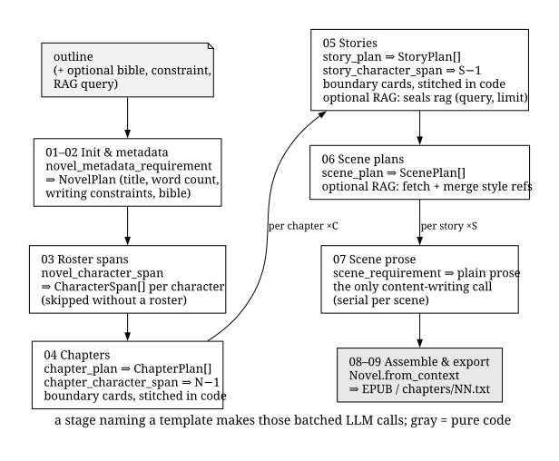
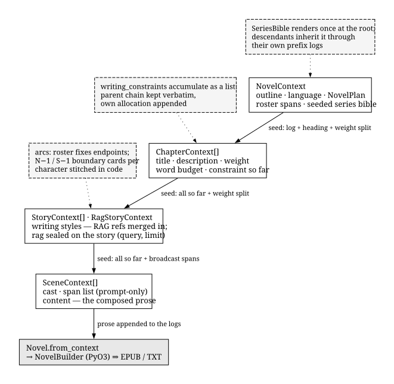
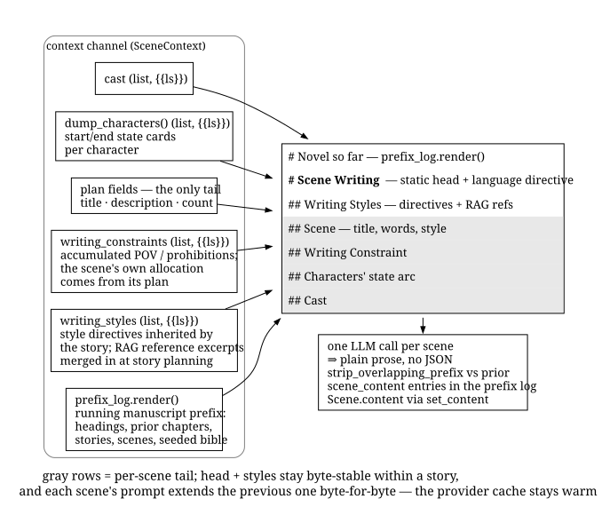

# `fabricatio-novel`

[MIT](https://img.shields.io/badge/license-MIT-blue.svg)

[](https://pypi.org/project/fabricatio-novel/)
[](https://pepy.tech/projects/fabricatio-novel)
[](https://pepy.tech/projects/fabricatio-novel)
[](https://github.com/PyO3/pyo3)
[](https://github.com/astral-sh/uv)

AI-powered novel generation — outline to publication-ready EPUB.

> Full dataflow and generation-logic walkthrough:
> [docs/superpowers/specs/2026-08-21-novel-generation-dataflow.md](../../docs/superpowers/specs/2026-08-21-novel-generation-dataflow.md)

## Installation

```bash
pip install fabricatio[novel]
# or
uv pip install fabricatio[novel]
```

For the CLI tool:

```bash
pip install fabricatio-novel[cli]
```

## Pipeline

Generation runs a staged, template-driven pipeline over a context tree
(`NovelContext → ChapterContext → StoryContext → SceneContext`), with every plan and
character state proposed by the LLM in batched calls:

1. **Metadata** — outline → `NovelPlan` (title, description, word count, global writing
   constraint, bible)
2. **Characters** — bible roster → one `CharacterSpan` (start + end card) per character
   for the whole novel
3. **Chapters** — chapter plans, then **N-1 boundary cards** per character so chapter 1
   starts at the roster start and the last chapter ends at the roster end
4. **Stories** — per chapter: story plans, then **S-1 boundary cards** per character
   anchored on the chapter's start/end
5. **Scenes** — per story: scene plans; the story's spans are broadcast to every scene,
   which is where the prose is actually written
6. **Assembly** — the composed context tree becomes a `Novel`; `NovelBuilder`
   (Rust/PyO3) produces the EPUB
7. **Illustration** (`wri` only) — one post-process pass proposes an image prompt per
   scene, renders it via ComfyUI, and embeds the PNGs in the EPUB

Character state is **two pure cards, never an interpolated chain**: the LLM is only
asked for the coarsest boundary states, and code stitches them so continuity is
guaranteed. Single-child levels inherit their parent's spans with no LLM call.

The CLI runs the pipeline as a **staged workflow** (`DebugNovelWorkflow`), persisting a
whole-tree JSON snapshot after every stage so any wrong result is traceable:

```
01_init → 02_metadata → 03_bible → 04_characters → 05_chapter_plans → 06_story_plans
       → 07_scene_plans → 08_scenes → 09_novel → export
```

An optional RAG variant (`RagDebugNovelWorkflow`) retrieves `WritingStyleDocument`
entries from LanceDB at two levels. The **novel** level searches the outline in the
init stage's before-hook and renders the documents into the metadata and
chapter-planning prompts. The **chapter** level retrieves once per story, renders the
documents raw into that story's scene prompts, and stops rendering them into later
prefix walks once every scene of the story carries content (the raw texts stay on the
context for scoring and audit).

The `wri` variant (`RagIllustrationDebugNovelWorkflow`) appends one final post-process
stage that illustrates every scene of the finished context before export; its stage
snapshots stay identical to `wr`'s.

## Data Flow & Prompt Assembly

The pipeline follows one principle: **every LLM touchpoint is a template plus named
context variables, and nothing else**. Each stage renders a Handlebars template from the
current context channel; planner calls parse the reply into validated pydantic models,
while the single prose call captures raw paragraphs. Everything between calls — word-count
allocation, character-arc stitching, prefix propagation, assembly — is deterministic code.

<p align="center"></p>

### LLM call inventory

| Stage | Template · prompted with | Yields |
|---|---|---|
| Metadata | `novel_metadata_requirement` ← `outline`, `language`, `constraint` | `NovelPlan` (adopted onto the root) |
| Roster spans | `novel_character_span` ← bible prompt block, title, description | `CharacterSpan[]` — skipped without a roster |
| Chapter plans | `plan_requirement` ← outline, novel fields, word count, styles, constraint, characters | `ChapterPlan[]` |
| Chapter boundaries | `boundary_requirement` ← roster spans, chapter titles/descriptions | N−1 boundary cards per character |
| Story plans | `plan_requirement` ← chapter fields, styles, constraint, characters, cast | `StoryPlan[]` |
| Story boundaries | `boundary_requirement` ← chapter spans, story titles/descriptions | S−1 boundary cards per character |
| Scene plans | `plan_requirement` ← story fields, styles, constraint, characters, cast | `ScenePlan[]` |
| Scene prose | `scene_requirement` ← 11 variables, see below | plain prose → `Scene.content` |
| Scene illustration | `scene_illustration_prompt` ← novel/chapter/story/scene titles, description, content, cast, `illustration_constraint` | `SketchSpec` (prompt, negative prompt, LLM-chosen `mp`/`prop`) → PNGs rendered concurrently per scene (post-process) |

Templates live in `templates/built-in/` and are selectable through the
[Configuration](#configuration) keys below.

### What flows down the tree

Each level materializes its plan via `create(outline).update_from(plan).set_plan(plan)`,
with word counts assigned out-of-band via `expect_` (the root takes the novel plan's
count, children take their allocated share). `update_from` adopts only the plan's scalar
fields (title, description, cast); the style channel is stacked explicitly by the composing
capability through `set_writing_styles` (the root from the novel plan, every child from its
parent's chain), and the constraint channel through `set_writing_constraints` (each level
from its own plan alone). Each level then passes state down:

- **Running manuscript** — an append-only `ContextLog`; every walk seeds each child with
  exactly the bytes that precede it in the final book (`iter_prefixed_contexts`)
- **Setting bible** — rendered once at the root into a `setting_bible` prefix entry;
  every descendant inherits it through its own log
- **Word budget** — each level splits its `expected_word_count` among children by plan weight
- **Writing style** — accumulated verbatim down the chain (style stacking)
- **Writing constraint** — scoped, never merged: each level carries its own entries, its planner
  sees the level above as the rules in force, and a scene's prose prompt renders only the
  scene's own list
- **Unit partition** — a level's children are proposed as one batch per parent, so the batch
  itself is the partition: the `## Requirements` block in the plan prompt keeps every unit
  inside the parent's description and makes the units cover it exactly once
- **Character arcs** — the roster fixes both endpoints; intermediate boundary cards are
  proposed per level and stitched in code; scenes receive the finished span list read-only

Composed prose flows back up: scene content enters the logs, and `Novel.from_context`
aggregates the whole tree for export.

<p align="center"></p>

### How a scene prompt is assembled

The scene write is the only content-producing call, so its prompt is engineered for
provider prefix caching: every row above `## Scene` is byte-identical across the scenes
of a story, and divergence starts exactly at the per-scene tail.

<p align="center"></p>


## Benchmark

Every finished run is measured against its own artifacts — no LLM calls, no re-execution.
`w`/`wr`/`wri` print the scorecard right after the run, next to the delta against the newest
comparable earlier run:

- **Hard gates** — terms the corpus marks as gated, a chapter export that disagrees with the scenes, an
  empty scene, prose in the wrong script.
- **Compared metrics** — length against target, both sides in the framework's own words (the core's
  `word_count`, the same counter the scene planner's satisfaction ratio uses), seam echo (the same
  moment written at the end of one scene and again at the top of the next), verbatim sentence repeats,
  cross-scene 12-gram overlap, sentence lengths (mean, median, max, spread and the share of run-on
  sentences, on the core's Unicode sentence segmentation), vocabulary repeats (how many n-grams repeat
  inside a fixed-size window, plus the most repeated n-grams), watch-term rate, run duration.
  Sentences and vocabulary are counted in characters, so every metric reads the same for a Chinese and
  an English run without a per-language rule.
- **Provenance** — a `plan_fingerprint` over the planning snapshots: two runs sharing it replayed
  planning from the cache, so they compare per scene, with an exact sign test over the scenes that
  changed.

A metric that moves off zero is never called noise — one gated term is a regression regardless of
sample size. A metric with no better side (how long the sentences are, how much their lengths vary)
reports an out-of-band move as drift instead of inventing a verdict. Semantic over-run (a scene staging
the next scene's beats in its own words) is deliberately **not** gated: calibration showed term
statistics cannot decide it, which is why `benchmark/scorecard.py` records what is measurable and what
is not.

The scorecard and the comparison are handlebars templates (`bench_scorecard`, `bench_comparison`), so
their wording and layout change without touching the scorer; the board is one table and nothing else,
so `Board` renders it directly. The scorer only measures: every number a report prints is carried by
the models themselves as a `*_display` field (handlebars has no arithmetic helpers, so rounding,
percentages and units are precomputed next to the measurement), and a table's column widths span
several rows (`Comparison.table`, `Board`), so the models measure and pad it for the same reason and
the template prints it as-is; `--json` leaves those report-only fields out of the machine-readable
form.

Each model also owns how it is read and measured, as classmethod factories — `StageArtifact.collect`/
`load`, `SceneRef.collect`, `SceneScore.of`, `RepetitionScore.of`, `ProbeScore.of` and their siblings —
so `benchmark/scorecard.py` only sequences those factories and no measurement lives outside the model
that carries it.

### Content probes

Term lists belong to a corpus, not to this package, so they live in one table beside it — `probes.toml`
in the working directory, which every `fanvl bench` command reads without being handed a path. `gated`
terms fail the run when they appear in the prose, `watch` terms are reported per 1000 characters (raw
and unlicensed — vocabulary the outline or the bible uses itself is licensed), and each `aliases`
group warns when one novel mixes two names for the same object.

```toml
gated   = ["hologram"]              # every occurrence fails the run
watch   = ["sapphire"]              # counted per 1000 characters
aliases = [["lamp", "lantern"]]     # names one object must not alternate between
```

JSON works as well. `--probes` measures a single invocation against another table, and `fanvl bench
scan` applies the same table to prose that has no run directory behind it:

```bash
fanvl bench score novels/20260101-101010     # one run's scorecard (--json for the raw form)
fanvl bench compare novels/20260101-101010   # against the newest comparable run (--against to pin one)
fanvl bench board novels -n 12               # the newest runs side by side
fanvl bench scan novels/ draft.txt           # manuscripts, chapters, drafts (dirs read every *.txt)
fanvl bench score novels/20260101-101010 --probes corpus/probes.toml
```

`--probes` defaults to `probes.toml` in the working directory, so a project with one table never repeats
a path, and a path that does not exist only skips the probe rows — the benchmark never fails a run over
its probe file. Without a table the corpus-independent metrics still run, and the probe row reads
`not configured`.

## Key Classes

### Context channels

| Class | Role |
|---|---|
| `NovelContext` | Root channel: outline, language, roster `charactor_span`, `chapter_context` |
| `RagNovelContext` | `NovelContext` subclass carrying the novel-level `RagRetrieval` settings and the documents fetched from the outline; renders them into the metadata and chapter-planning prompts |
| `ChapterContext` | Chapter channel: `charactor_span`, `story_context`, heading block |
| `RagChapterContext` | `ChapterContext` subclass whose stories are `RagStoryContext`s; the RAG chapter stage promotes what it plans, so a reloaded snapshot keeps the sealed types |
| `StoryContext` | Story channel: `charactor_span`, `scene_context`, accumulated `writing_styles` |
| `RagStoryContext` | `StoryContext` subclass sealed with `RagRetrieval` settings; the RAG pipeline swaps it in before scene planning and stops rendering its references once every scene of the story carries content |
| `SceneContext` | Leaf channel: broadcast `charactor_span`, `content` (the only composed prose) |
| `CharacterSpan` | Start + end `CharacterCard`; `derive_child_spans` stitches boundary cards |
| `ContextLog` / `ContextEntry` | Append-only manuscript log per channel: `append`, `branch` (fork history), `clear` (fresh fork); renders the prefixed-content prompt streams |
| `SeriesBible` | `characters` name list + `background_settings` fact list; rendered once into a `setting_bible` prefix entry at the root |

Every channel carries its running manuscript as an **append-only `ContextLog`**: composed
blocks enter as frozen `ContextEntry` records, parents seed children with pure log snapshots,
and prompts render them exactly like the former prefixed-content strings. Logs support
`with_entry`/`with_entries` appends, `branch()` to fork alternative continuations from any
point (copy-on-write), and `clear()` which returns a fresh empty log while the original
history stays intact.

### Plans & models

| Class | Description |
|---|---|
| `NovelPlan` | Novel metadata: title, description, word count, global constraint, bible |
| `ChapterPlan` / `StoryPlan` / `ScenePlan` | Weighted per-element plans (title, description, weight, style, constraint, cast) |
| `Scene` / `Story` / `Chapter` / `Novel` | Materialized output tree with word-count satisfaction |
| `SketchSpec` / `IllustratedScene` | LLM-proposed generation instruction — positive/negative prompt plus per-scene `mp`/`prop` (comfyui model); the scene output carrying its rendered illustration |
| `WritingStyleDocument` / `EnrichedDocument` | LanceDB-backed writing-style references |

### Capabilities (mixins)

| Class | Description |
|---|---|
| `SceneCompose` | Scene requirement rendering + prose generation |
| `StoryCompose` | Scene planning, scene write preparation, serial scene composition |
| `ChapterCompose` | Story planning, `draft_story_spans` (S-1 boundary cards), story composition |
| `NovelCompose` | Metadata, `prepare_character_span` (roster), chapter planning, `draft_chapter_spans` (N-1 boundary cards) |
| `RAGStyleFetch` | Writing-style retrieval shared by the RAG-bound levels: the `rag_query`/`rag_limit` settings plus the decomposed multi-head search |
| `RAGNovelCompose` | Seals the root with the retrieval settings in `before_compose_novel_context`, searches the outline, and renders the documents into the metadata and chapter-planning prompts |
| `RAGChapterCompose` | Retrieves style docs once per story, extends scene prompts, and stops rendering them into later prefix walks once the story's scenes are written |
| `BibleCompose` | Composes the setting bible from the outline once; immutable for the run |
| `IllustrateScenes` | Post-process illustration: batch-proposes one complete generation instruction (`SketchSpec`: prompt, negative prompt, LLM-chosen `mp`/`prop`) per pending scene (honoring `illustration_constraint`), renders them concurrently via ComfyUI into the run's `images/` directory, and attaches `IllustratedScene` outputs |

### Actions (staged workflow)

| Action | Stage |
|---|---|
| `InitNovelContext` / `RagInitNovelContext` | `01_init` — build context from outline/language/constraint/bible, then fire `before_compose_novel_context` (the RAG variant's hook seals the root and searches the outline) |
| `ProposeNovelMetadataStage` | `02_metadata` — `propose_novel_metadata` |
| `ProposeSettingBibleStage` | `03_bible` — `compose_setting_bible`, then seed the bible prefix; skipped when a bible is already present |
| `PrepareCharacterSpanStage` | `04_characters` — `prepare_character_span` (roster) |
| `PlanChaptersStage` / `RagPlanChaptersStage` | `05_chapter_plans` — `plan_chapters_phase` + boundary drafting (the RAG variant renders the novel's references and promotes the chapters to `RagChapterContext`) |
| `PlanStoriesStage` / `RagPlanStoriesStage` | `06_story_plans` — fires `before_compose_chapter_context` per chapter, then `plan_stories_phase` + boundary drafting (RAG seals each chapter's stories) |
| `PlanScenesStage` / `RagPlanScenesStage` | `07_scene_plans` — fires `before_compose_story_context` per story, then `plan_scenes_phase` (with RAG) |
| `ComposeScenesStage` / `RagComposeScenesStage` | `08_scenes` — writes scene prose, then closes each story (`after_compose_story_context` + `post_process_story`) and each chapter (`after_compose_chapter_context` + `post_process_chapter`) |
| `AssembleNovelStage` | `09_novel` — fires `after_compose_novel_context`, then `assemble_novel` |
| `IllustrateNovelStage` | `DumpNovelStage` whose `post_process_novel` resolves to per-scene illustration; adds no snapshot dir |
| `DumpNovelStage` | fires `post_process_novel`, then export — JSON always; EPUB and/or per-chapter `chapters/NN.txt` per `format` |

Every stage wraps one `compose_novel` chain segment and fires the chain's lifecycle hooks at their chain positions, so a hook override on a stage customizes the staged run exactly like it customizes the programmatic chain; the scene-level hooks fire inside `compose_scenes_phase`, exactly as they do in the chain.

### Workflows

| Workflow | Description |
|---|---|
| `DebugNovelWorkflow` | Outline → exported novel (`--format epub\|txt\|both`), one stage per action with per-stage snapshots |
| `RagDebugNovelWorkflow` | Same, with writing-style RAG at the novel (outline) and story levels |
| `RagIllustrationDebugNovelWorkflow` | Same, plus a single post-process pass that renders a ComfyUI illustration for every scene into the EPUB |

### Rust / PyO3

| Symbol | Description |
|---|---|
| `NovelBuilder` | Builder for EPUB 3.0 novels: title/description/authors, chapters (auto-XHTML), cover, fonts, CSS, TOC |
| `text_to_xhtml_paragraphs` | Plain text → `<p>`-wrapped XHTML paragraphs |

## Configuration

All options below are read through the fabricatio configuration chain (see the
[Configuration Guide](../../docs/source/configuration.rst)). Set them under the
`[ext.novel]` table in `fabricatio.toml`, equivalently under
`[tool.fabricatio.ext.novel]` in `pyproject.toml`, or via
`FABRICATIO_EXT__NOVEL__<FIELD_UPPER>` environment variables.

```toml
[ext.novel]
novel_metadata_requirement_template = "built-in/novel_metadata_requirement"
```

| Option | Type | Default | Description |
|---|---|---|---|
| `novel_metadata_requirement_template` | `str` | `"built-in/novel_metadata_requirement"` | template used to extract the novel metadata (title, synopsis, word count) from the outline. |
| `plan_requirement_template` | `str` | `"built-in/plan_requirement"` | template used to plan the chapters of the novel, the stories of a chapter and the scenes of a story. |
| `scene_requirement_template` | `str` | `"built-in/scene_requirement"` | template used to write a single scene in full prose. |
| `render_chapter_xhtml_template` | `str` | `"built-in/render_chapter_xhtml"` | template used to render a chapter as a full XHTML document. |
| `scene_overlap_min_chars` | `int` | `40` | minimum whitespace-normalized overlap between a new scene's prefix and the previous prose that gets stripped; shorter echoes are kept. |
| `scene_overlap_max_ratio` | `float` | `0.6` | maximum fraction of a generated scene the overlap may cover before the content is kept untouched with a warning instead of stripped. |
| `bench_scorecard_template` | `str` | `"built-in/bench_scorecard"` | template used to render one run's benchmark scorecard. |
| `bench_comparison_template` | `str` | `"built-in/bench_comparison"` | template used to render two runs' benchmark comparison. |
| `setting_bible_characters_template` | `str` | `"built-in/setting_bible_characters"` | template used to propose the bible's character roster as a list of plain strings, one character per item. |
| `setting_bible_background_template` | `str` | `"built-in/setting_bible_background"` | template used to propose the bible's background settings as a list of strings. |
| `setting_bible_context_template` | `str` | `"built-in/setting_bible_context"` | template that renders the bible into the block seeded into the running manuscript prefix. |
| `setting_bible_export_template` | `str` | `"built-in/setting_bible_export"` | template used to render the bible as a human-readable markdown document. |
| `writing_style_as_prompt_template` | `str` | `"built-in/writing_style_as_prompt"` | template used to render writing style documents as prompts. |
| `enriched_as_prompt_template` | `str` | `"built-in/enriched_as_prompt"` | template used to render enriched reference documents as prompts. |
| `novel_character_span_template` | `str` | `"built-in/novel_character_span"` | template used to propose the novel roster as one CharacterSpan per character. |
| `boundary_requirement_template` | `str` | `"built-in/boundary_requirement"` | template used to draft the N-1 chapter- and the S-1 story-boundary cards from the parent's spans. |
| `scene_illustration_prompt_template` | `str` | `"built-in/scene_illustration_prompt"` | template used to propose one image-generation prompt for a composed scene. |
| `illustration_constraint` | `str` | `""` | global style/content constraint merged into every scene illustration prompt proposal; empty when unset. |
| `illustration_negative_prompt` | `str` | quality/anatomy exclusion list | negative prompt forwarded to ComfyUI for every scene illustration unless the proposal supplies its own. |
| `illustration_prompt_suffix` | `str` | `"best quality,masterpiece,4k,highres"` | quality tags appended to every scene illustration render prompt after the LoRA trigger augmentation; set empty to append nothing. |
| `illustration_always_loras` | `list[LoraEntry]` | `[]` | LoRA entries chained into every scene illustration render before any selection — the slot for always-on style/character loras; each entry's `trigger_words` activate it in the prompt. Selectable loras live in the `[ext.comfyui] loras` catalog, where the LLM picks per scene on top of this chain. |
| `illustration_choose_loras` | `bool` | `False` | opt-in per-scene LLM LoRA selection from the `[ext.comfyui] loras` catalog during illustration; off by default. `illustration_always_loras` chains regardless of this flag. |
| `illustration_judge` | `bool` | `False` | opt-in per-scene visual judgement of each rendered illustration via a vision LLM; off by default. A failed verdict re-proposes the illustration prompt with the accumulated defect feedback and re-renders; an unavailable judge (`None` verdict) accepts the image. |
| `illustration_judge_max_tries` | `int` | `3` | total generation attempts per scene when `illustration_judge` is on; the last attempt's image is always kept, judged or not. Rejected attempts are archived beside the canonical PNG as `scene_XX_YY.attempt<N>.png`. |
| `scene_illustration_feedback_template` | `str` | `"built-in/scene_illustration_feedback"` | template rendering the rejected-attempt feedback tail appended to the requirement when a judged render is retried. |
| `illustration_mp` | `float \| None` | `None` | megapixel budget of each scene illustration's finished image (1.0 = 1,000,000 px); a per-scene proposal's `mp` wins, otherwise `None` falls back to `[ext.comfyui] mp`, then the active ComfyUI template's canvas. |
| `illustration_mp_max` | `float` | `1.2` | hard ceiling on every scene illustration's megapixel budget, enforced at render time even when the LLM proposes a larger `mp`; the renderable quality brink (512x512x2.2x2.2) is ~1.27 MP, so 1.2 keeps a margin under it. |
| `illustration_prop` | `Prop \| None` | `None` | aspect-ratio preset of each scene illustration — enum member names like `prop_2_3` (portrait), coerced to the `Prop` enum at load; a per-scene proposal's `prop` wins, otherwise `None` falls back to `[ext.comfyui] prop`, then the active ComfyUI template's ratio. |
| `illustration_seed` | `int \| None` | `None` | scene illustration sampler seed; `None` keeps the bundled ComfyUI template's seed. |
| `illustration_skip_existing` | `bool` | `True` | skip scenes whose illustration PNG already exists so re-runs fill only the gaps. |
| `illustration_timeout_per_image` | `float` | `210.0` | per-image render timeout in seconds; the total render timeout scales linearly with the batch size (value x pending renders) since all renders share one ComfyUI queue; `0` falls back to `[ext.comfyui] timeout`. |

Access at runtime: `from fabricatio_novel.config import novel_config`.

## Usage

### CLI

```bash
# Generate a novel from an outline
fanvl w -o "In a world where dreams are currency..."

# Generate with writing style RAG (LanceDB)
fanvl wr -o "In a world where dreams are currency..." -rq "Hemingway terse prose style"

# Generate with RAG + ComfyUI scene illustrations embedded in the EPUB
fanvl wri -o "In a world where dreams are currency..." -rq "Hemingway terse prose style"
fanvl wri -o "..." --choose-loras  # per-scene LLM-chosen LoRAs from the [ext.comfyui] catalog
fanvl wri -o "..." --judge --judge-tries 5  # vision-judge each illustration; retry with a revised prompt up to N total attempts

# Constrain generation with a setting bible + global writing constraint
fanvl w -o "..." -b settings/bible.json -c "first person view throughout"

# Export as plain text instead of (or besides) EPUB: chapters/01.txt, 02.txt, …
fanvl w -o "..." --format both
fanvl w -o "..." --format txt

# Create / update / show the setting bible
fanvl bible create -o "In a world where dreams are currency..." --out settings/bible.json
fanvl bible update settings/bible.json -o "..." --sections characters
fanvl bible show settings/bible.json

# Store reference texts as writing style documents in LanceDB
fanvl store-refs ./corpus/*.txt
fanvl enrich-refs ./corpus/*.txt -eg "Extract world-building facts"
```

### Programmatic

```python
from fabricatio_novel.workflows.novel import DebugNovelWorkflow
from fabricatio_core import Event

event = Event.instantiate("write")
event.payload["novel_outline"] = "In a world where dreams are currency..."
role = Role.with_bio(name="writer").subscribe(event, DebugNovelWorkflow).dispatch()
```

### EPUB Builder (Rust)

```python
from fabricatio_novel.rust import NovelBuilder, text_to_xhtml_paragraphs

xhtml = text_to_xhtml_paragraphs(raw_chapter_text)

builder = (
    NovelBuilder()
    .new_novel()
    .set_title("My Novel")
    .add_author("Author Name")
    .add_chapter("Chapter 1", xhtml)
    .add_inline_toc()
)

builder.export("output.epub")
```

## Dependencies

- `fabricatio-core` — Core interfaces, template management, LLM capabilities
- `fabricatio-character` — Character card models
- `pydantic` — Data validation via models
- Optional: `fabricatio-lancedb` — writing style RAG, `typer` — CLI

## License

MIT — see [LICENSE](../../LICENSE)
